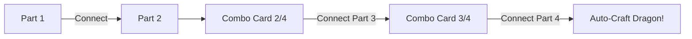

# 🎮 Gameplay Systems Document

---

## 1. Resource & Inventory System

The player tracks five key item pools. These items do not take up spatial slots in a grid; instead, they act as simple numeric counters stored inside the player inventory configuration.

| Resource | Primary Input Source | Sinks / Cost Requirements |
|---|---|---|
| **Apples (🍎)** | Walk into apple trees; use Food/Farming cards on dragons | Feed dragons (restores Hunger +15, HP +15) |
| **Coins (🪙)** | Destroy rocks; defeat Black Dragons; win Battle Arena fights | Buy dragons from Store; buy card packs; upgrade houses |
| **Wood (🪵)** | Use Trees cards on dragons; Blacksmith houses | Build Dragon Houses; upgrade houses |
| **Fish (🐟)** | Use Fishing Rod cards on dragons | Build Dragon Houses |
| **Stone (🪨)** | Mine houses | Build Castles |

### Collection Mechanics

- **Tree Harvester**: Overlapping with a tree sprite adds `1` to `apples` (checks `this.time.now` to enforce a 2,000ms cooldown).
- **Rock Buster**: Overlapping with a rock destroys the sprite immediately and adds `1` to `coins`. Rocks do not respawn during a single game session.

---

## 2. Dragon Booster Pack Store

Booster packs introduce card items into the player's possession.

- **Cost**: 10 Coins.
- **Draw Rate**: Yields exactly 3 cards per pack.
- **Probability**: All card types have an equal chance of appearing:
  - Food / Farming Cards: `Delicious Food`, `Apple Seeds` (both map to `apple` key).
  - Production Cards: `Ancient Tree` (wood), `Fishing Rod` (fish).
  - Crafting Part Cards: `Dragon Head`, `Dragon Wings`, `Dragon Tail`, `Dragon Body`.

### Reveal Animation
When opened, the screen darkens. Three cards are instantiated off-screen, scaled to `0`, and scaled up sequentially using a `Back.easeOut` tween with a 300ms delay stagger.

---

## 3. Card Connection & Crafting System

In the **Crafting Center (⚒️)**, the player interacts with collected cards. Selecting a card outlines it in yellow.



### Connection Rules
- Only **Part** or **Combo** cards can connect.
- You cannot combine parts that share a duplicate component (e.g., combining two `part_head` cards is disallowed).
- Connecting two cards deletes both inputs and appends a single merged `Combo` card listing all current subcomponents inside its metadata.

### Auto-Crafting
When a combination card grows to contain all four components (`part_head`, `part_wings`, `part_tail`, `part_body`), the combination card is consumed. A new dragon of a random type (Fire, Ice, Storm, etc.) is instantly created and added to the player's collection.

---

## 4. Construction & Upgrades

The **Construction Hub (🏗️)** handles building placement. Structures spawn near the player's coordinates, pushing away any overlapping dragons.

```
       [Build House]                    [Build Castle]
     (3 Wood + 1 Fish)                    (10 Stone)
             │                                │
             ▼                                ▼
       Spawns House                    Spawns Castle
             │                                │
    ┌────────┼────────┐                       ▼
    ▼        ▼        ▼             Generates Defensive Wall
  Tower     Mine  Blacksmith        ring with bottom-center gap
```

### Upgrade Paths

Houses start with no class attributes (`upgradeType = null`). Clicking a placed structure opens the Upgrade options:

| Upgrade Class | Cost | Gameplay Action | Visual Indicator |
|---|---|---|---|
| **Tower** | 10 Wood + 5 Coins | Auto-targets and fires golden arrows at the nearest Black Dragon in a 400px range. Deals 20 damage every 2.5 seconds. | Light blue tint (`0x90caf9`), 🏰 icon prefix |
| **Mine** | 15 Wood + 5 Coins | Passively generates +1 Stone resource every 5 seconds. | Gold tint (`0x51c40f`), ⛏️ icon prefix |
| **Blacksmith** | 20 Wood + 10 Coins | Passively generates +1 Wood resource every 5 seconds. | Red-orange tint (`0xffab91`), 🔨 icon prefix |

### Defensive Castle Wall Construction
Building a Castle (10 Stone) triggers defensive grid layout algorithms. It clears all existing walls, identifies the bounding rectangle containing all houses and castles, adds a 120px margin padding, and places wall segments (scaled to 40×40 pixels) sequentially with a staggered entrance tween. The bottom edge leaves a gap to allow entry and exit.

---

## 5. Combat Systems

### Overworld Combat
- If an enemy Black Dragon is within **250px**, the player can click on it.
- Clicking triggers a player sprite lunge tween toward the enemy, instantiates a hit flash emoji (💥), deals 35 damage, and subtracts HP from the enemy.
- Defeating a Black Dragon pays out 3 coins.

### Battle Arena (Scene)
Triggered from the Dragon Menu -> **Fight**.

1. **Team Builder**: The player selects up to 3 owned dragons to populate their team slots.
2. **Setup**: The player team starts on the left face-off; the selected opponent dragon stands on the right. Both possess 100 HP.
3. **Player Attack**: Clicking the player dragon triggers a lunge tween, fires a fireball projectile toward the opponent, and inflicts 10 damage.
4. **Opponent Attack**: An automated background timer triggers attacks from the opponent dragon at random intervals between 2,000ms and 5,000ms.
5. **Team Swapping**: When the active player dragon's health drops to 0, the next dragon in the selected roster slides in with fully restored health.
6. **Victory / Defeat**:
   - Defeating the opponent dragon pays out 10 coins.
   - Losing all team dragons triggers defeat (returns to map, no stat penalty).
