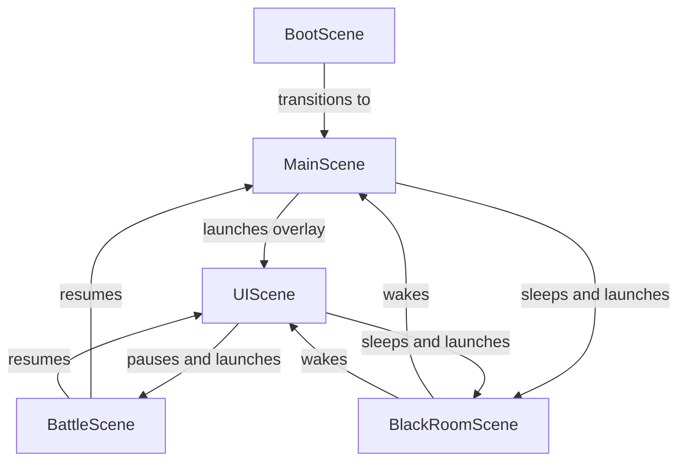

# 🏗️ Technical Architecture Document

---

## 1. Scene Management & State Machine

The game is divided into distinct execution contexts managed via a scene system. Each scene represents a specific state or visual overlay.



### Scene Responsibilities

| Scene | Purpose | State Lifecycle |
|---|---|---|
| **BootScene** | Preloads all image assets, configurations, and textures. Immediately launches the `MainScene` upon completion. | Transient (Preload only) |
| **MainScene** | Handles the 2D physics world, collision layers, companion follow AI, enemy spawning, enemy chasing AI, static groups (trees/rocks), player buildings (houses/castles), and global/passive game timers. | Persistent |
| **UIScene** | Renders screen-space HUD components (Backpack, Cart, Craft, Build, Smile) and all interactive overlay menus (Inventory, Store, Packs, Dragon Menu, Status Page, Fighter Selection, Build Options, House Upgrades, Game Over). Runs concurrently above the `MainScene`. | Persistent overlay |
| **BattleScene** | Implements the turn-based style click combat arena. Shows battle status, processes dragon attacks (fireballs), switches dragons, and handles reward payouts or defeat conditions. | Activated / Destroyed as needed |
| **BlackRoomScene**| Displays an atmospheric ambient screen (easter egg) with floating dust particles. Shuts down the visual overworld when active. | Activated / Destroyed as needed |

---

## 2. Event-Driven Communication

The scenes communicate asynchronously using a global Event Emitter. The `MainScene` acts as the single source of truth for the game state, while `UIScene` listens for changes to update UI elements and emits actions triggered by the player.

### Event Manifest

| Event Name | Emitter | Listener | Payload | Description |
|---|---|---|---|---|
| `dragonAdded` | `UIScene` | `MainScene` | `{ name: string, key: string }` | Spawns a newly purchased or crafted dragon in the world. |
| `petDragon` | `UIScene` | `MainScene` | `dragonData` (object) | Triggers the petting animation, love increase, and HP restoration. |
| `giveTree` | `UIScene` | `MainScene` | `{ dragon: object, card: object }` | Attaches a passive wood-generating card to a dragon. |
| `giveFishingRod`| `UIScene` | `MainScene` | `{ dragon: object, card: object }` | Attaches a passive fish-generating card to a dragon. |
| `giveAppleCard` | `UIScene` | `MainScene` | `{ dragon: object, card: object }` | Attaches a passive apple-generating card to a dragon. |
| `buildHouse` | `UIScene` | `MainScene` | None | Spawns a standard dragon house near the player. |
| `buildCastle` | `UIScene` | `MainScene` | None | Spawns a castle and triggers wall generation. |
| `showDragonMenu`| `MainScene` | `UIScene` | `dragonData` (object) | Tells the UI to display the context menu for a clicked dragon. |
| `showHouseUpgradeMenu`| `MainScene`| `UIScene` | `house` (sprite) | Tells the UI to show the upgrade/status menu for a house. |
| `updateStats` | `MainScene` / `UIScene` | `UIScene` | `stats` (object) | Updates status bar representations for dragon attributes. |
| `refreshActiveStats` | `MainScene` | `UIScene` | None | Refreshes UI bars for the currently inspected dragon. |
| `updateApples` | `MainScene` | `UIScene` | `count` (number) | Syncs current apple count. |
| `updateCoinCount`| `MainScene` | `UIScene` | `count` (number) | Syncs current coin count. |
| `updateWoodCount`| `MainScene` | `UIScene` | `count` (number) | Syncs current wood count. |
| `updateFishCount`| `MainScene` | `UIScene` | `count` (number) | Syncs current fish count. |
| `updateStoneCount`| `MainScene`| `UIScene` | `count` (number) | Syncs current stone count. |
| `collectAppleAnim`| `MainScene`| `UIScene` | None | Triggers backpack pulse effect. |
| `gameOver` | `MainScene` | `UIScene` | None | Triggers game over screen. |

---

## 3. Data Structures & State Model

The overall game state resides inside the `MainScene` context. Key variables:

### Resource State Variables
- `this.apples`: integer
- `this.coins`: integer
- `this.wood`: integer
- `this.fish`: integer
- `this.stone`: integer

### Player Collection Data
- `this.ownedDragons`: Array of dragon data structures:
  ```json
  {
    "name": "Phillis",
    "key": "dragon",
    "stats": {
      "love": 20,
      "hunger": 80,
      "energy": 100,
      "hp": 100,
      "level": 1,
      "xp": 0
    }
  }
  ```
- `this.ownedCards`: Array of card items inside card inventory:
  ```json
  {
    "name": "Dragon Head",
    "type": "Part",
    "key": "part_head",
    "parts": ["part_head"] // Combos list nested parts
  }
  ```

### World Structure Properties
- Placed houses & castles are physics sprites added to the static group `this.houses`.
- Each house/castle has:
  - `house.upgradeType`: `null` | `"tower"` | `"mine"` | `"blacksmith"`
  - `house.label`: Text object reference (updates position/text)

---

## 4. Passive Timers & Loops

The system uses passive loops for background game logic, handled independently of frame rates.

1. **Global Stat Decay Loop** (Every 15,000ms):
   - Iterates through all `this.ownedDragons`.
   - Deducts `1` point of `hunger` and `1` point of `energy` (floor at 0).
   - Emits `refreshActiveStats` to sync the visible UI.

2. **House Passive Yield Loop** (Every 5,000ms):
   - Iterates through all houses/castles in `this.houses`.
   - If `upgradeType === 'mine'`: Adds `1` to `this.stone`. Emits floating text floating up from the house.
   - If `upgradeType === 'blacksmith'`: Adds `1` to `this.wood`. Emits floating text.

3. **Tower Defense Attack Loop** (Every 2,500ms):
   - Iterates through all houses/castles.
   - If `upgradeType === 'tower'`: Finds closest Black Dragon within 400 pixels.
   - Shoots a projectile vector. When it hits, applies 20 damage to the target.

4. **Black Dragon Spawner Loop** (Every 25,000ms):
   - Spawns a new Black Dragon if the active count is below `4`.

5. **Individual Card Passive Generator Timers**:
   - Created dynamically when giving a resource card to a dragon.
   - Triggers every 5,000ms for 12 cycles (60 seconds total).
   - Generates resource (+1 apple/wood/fish) and shows visual floating indicators on the dragon's coordinate position.

---

## 5. Save System Specification

*The current implementation has no persistence mechanism.* To rebuild this game with a save system, the following data format should be read/written to local storage or file systems:

### Proposed JSON Save Schema

```json
{
  "saveVersion": 1,
  "timestamp": 1783428900000,
  "resources": {
    "apples": 12,
    "coins": 45,
    "wood": 8,
    "fish": 2,
    "stone": 10
  },
  "ownedDragons": [
    {
      "name": "Phillis",
      "key": "dragon",
      "stats": {
        "love": 35,
        "hunger": 70,
        "energy": 90,
        "hp": 100,
        "level": 2,
        "xp": 45
      }
    },
    {
      "name": "Fire Dragon",
      "key": "dragon_fire",
      "stats": {
        "love": 10,
        "hunger": 50,
        "energy": 100,
        "hp": 100,
        "level": 1,
        "xp": 0
      }
    }
  ],
  "ownedCards": [
    { "name": "Ancient Tree", "type": "Trees", "key": "tree" },
    { "name": "Dragon Head", "type": "Part", "key": "part_head" }
  ],
  "structures": [
    {
      "x": 950.4,
      "y": 1020.2,
      "type": "house",
      "upgradeType": "tower"
    },
    {
      "x": 1120.0,
      "y": 910.5,
      "type": "castle",
      "upgradeType": null
    }
  ]
}
```
